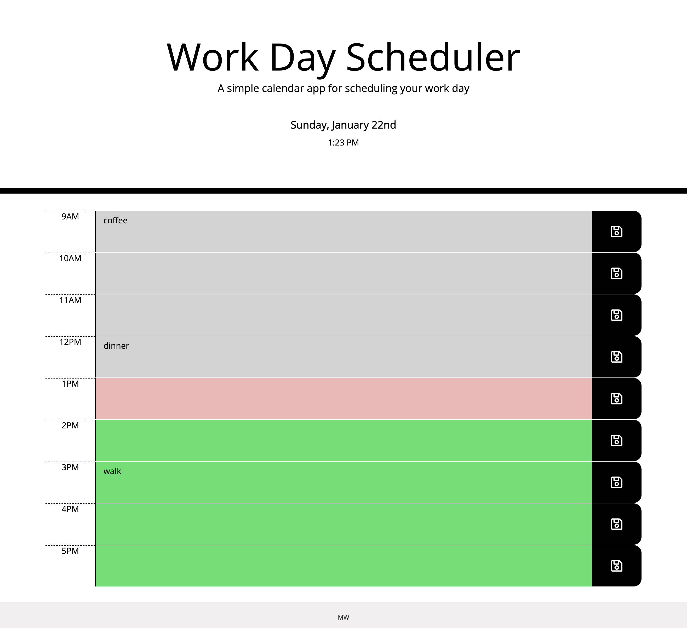

# challenge7-Planner-App

# Description 
> In challenge 7 I created a calendar application that allows a user to save events for each working hour of the day (between 9am-5pm). 

## Usage 
To access the solution open the below link to deployed application.
* Deployed application - [https://marzena-w.github.io/planner-app/]
* add memo in a text area
* Save button on the right
* Screenshot of the challenge7:

## Credits

* About textarea - [https://developer.mozilla.org/en-US/docs/Web/HTML/Element/textarea]
* momentjs - [https://momentjs.com/docs/]
* moment.hour() Method - [https://www.geeksforgeeks.org/moment-js-moment-hour-method/]
* To see website updates - Live Server - [https://marketplace.visualstudio.com/items?itemName=ritwickdey.LiveServer]

## License
MIT
